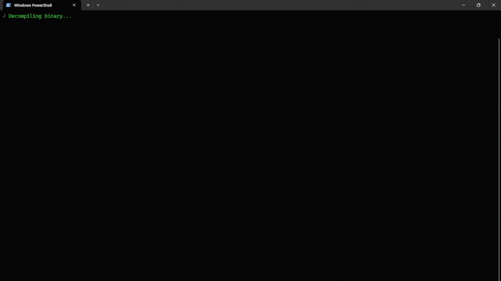

<p align="center">
    
  </a>
</p>
<p align="center"> 🤖 Large Language Model for Binary Analysis Search 🧐 </p>

<div align="center">


<br>

</div>

Monocle is tooling backed by a large language model for performing natural language searches against compiled target binaries. Monocle can be provided with a binary and a search criteria (e.g., authentication code, vulnerable code, password strings, and more), and it will decompile the binary and use its in-built LLM to identify and score areas of the code that meet the criteria. 
* **🔬 Binary Search:** Without any prior knowledge, Monocle will support in answering binary analysis questions related to the target.
* **🤖 Natural Language and Open-Ended Questions:** As Monocle is backed by an LLM queries passed to it are written in plain text.
* **🛠️ Ghidra Enabled:** Monocle uses Ghidra headless to enable decompilation of compiled binaries!

# ⚙️ Setup

## System Requirements
Monocle uses the Mistral-7B-Instruct-v0.2 model, and where possible offloads processing to your system's GPU. It is recommended to run Monocle on a machine with a minimum of 16GB of RAM and a dedicated Nvidia GPU with at least 4GB of memory. **However,** it can run on lower spec machines, but will be significantly slower.

**Monocle has been tested on Windows 11; however, it should be compatible with Unix and other systems.**

## Dependencies
Monocle requires **Nvidia CUDA** which allows for greatly increased performance of the LLM. For this follow the below steps:
- Ensure your Nvidia drivers are up to date: https://www.nvidia.com/en-us/geforce/drivers/
- Install the appropriate dependancies from here: https://pytorch.org/get-started/locally/
- Validate CUDA is installed correctly by running the following and being returned a prompt ```python -c "import torch; print(torch.rand(2,3).cuda())"```

Monocle requires [Ghidra](https://ghidra-sre.org/) to be installed and accessible. Additionally, ensure that `analyzeHeadless` is available in your environment. 

Python dependencies can be found in the `requirements.txt` file:

```
pip install -r requirements.txt
```

Monocle can then be installed using the `./setup.py` script as below:

```
python -m pip install .
```

## Running

To utilize Monocle, follow the instructions below:

### Natural Language Search
Execute Monocle with the appropriate parameters to conduct binary search tasks.

**Windows**
```bash
monocle.exe --binary <path-to-binary> --find <component-to-find>
```
**Unix**
```
monocle --binary <path-to-binary> --find <component-to-find>
```
### Output
As Monocle processes the functions present in the provided binary, it keeps a live tracker, sorted by the highest score, of all analyzed functions, their score between 0 and 10 (where 0 means the function does not meet the search criteria and 10 means it does), alongside an explanation of why the score was awarded. Scores of 0 do not have their explanation provided.

The format of this live display can be seen below:

```
                                             Authentication Code
┏━━━━━━━━━━━━━┳━━━━━━━━━━━━━━━┳━━━━━━━┳━━━━━━━━━━━━━━━━━━━━━━━━━━━━━━━━━━━━━━━━━━━━━━━━━━━━━━━━━━━━━━━━━━━━━━┓
┃ BINARY NAME ┃ FUNCTION NAME ┃ SCORE ┃ EXPLANATION                                                          ┃
┡━━━━━━━━━━━━━╇━━━━━━━━━━━━━━━╇━━━━━━━╇━━━━━━━━━━━━━━━━━━━━━━━━━━━━━━━━━━━━━━━━━━━━━━━━━━━━━━━━━━━━━━━━━━━━━━┩
│ pure-authd  │ FUN_080480c5  │ 1     │ The code contains a message asking to compile the server with a      │
│             │               │       │ specific flag to use a feature, which could be related to            │
│             │               │       │ authentication. However, there is no actual authentication code      │
│             │               │       │ visible in the provided function.                                    │
│ pure-authd  │ FUN_080480b4  │ 0     │                                                                      │
└─────────────┴───────────────┴───────┴──────────────────────────────────────────────────────────────────────┘
                                                   Monocle                                                    
```

### Examples
Below is an example of using Monocle on the ```pure-authd``` x86 binary [found here](https://github.com/polaco1782/linux-static-binaries/blob/master/x86-i686/pure-authd) to search for authentication code.

```
python.exe /Monocle/monocle.py --binary "..\linux-static-binaries-master\linux-static-binaries-master\x86-i686\pure-authd" --find "authentication code"
```
<p align="center">
    
  </a>
</p>

# 🤖 Mistral-7B-Instruct-v0.2
Behind the scenes Monocle uses the ```Mistral-7B-Instruct-v0.2``` model from The Mistral AI Team - see [here](https://arxiv.org/abs/2310.06825). The Mistral-7B-Instruct-v0.2 Large Language Model (LLM) is an instruct fine-tuned version of the Mistral-7B-v0.2. More can be found on the model [here!](https://huggingface.co/mistralai/Mistral-7B-Instruct-v0.2).
- 7.24B params
- Tensor type: BF16
- 32k context window (vs 8k context in v0.1)
- Rope-theta = 1e6
- No Sliding-Window Attention

# 🙏 Contributions
Monocle is an open-source project and welcomes contributions from the community. If you would like to contribute to
Monocle, please follow these guidelines:

- Fork the repository to your own GitHub account.
- Create a new branch with a descriptive name for your contribution.
- Make your changes and test them thoroughly.
- Submit a pull request to the main repository, including a detailed description of your changes and any relevant documentation.
- Wait for feedback from the maintainers and address any comments or suggestions (if any).
- Once your changes have been reviewed and approved, they will be merged into the main repository.

# ⚖️ Code of Conduct
Monocle follows the Contributor Covenant Code of Conduct. Please make sure to review and adhere to this code of conduct when contributing to Monocle.

# 🐛 Bug Reports and Feature Requests
If you encounter a bug or have a suggestion for a new feature, please open an issue in the GitHub repository. Please provide as much detail as possible, including steps to reproduce the issue or a clear description of the proposed feature. Your feedback is valuable and will help improve Monocle for everyone.

# 📜 License

[GNU General Public License v3.0](https://choosealicense.com/licenses/gpl-3.0/)
